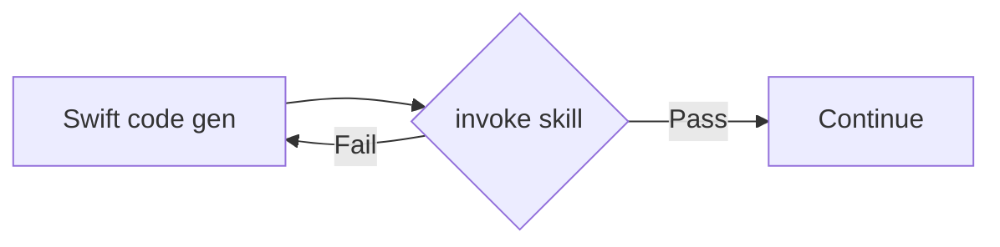
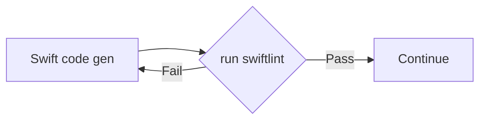
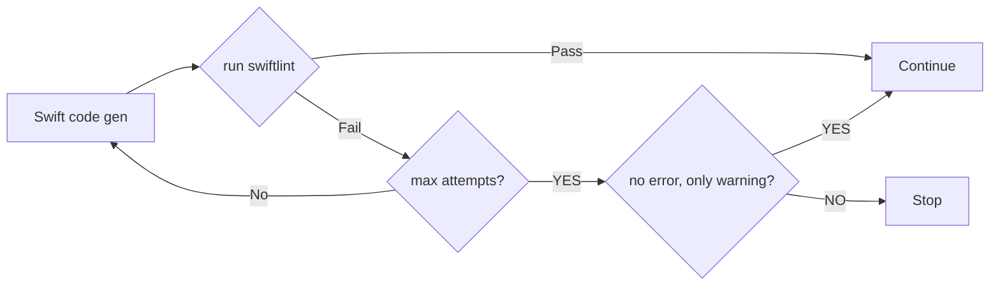
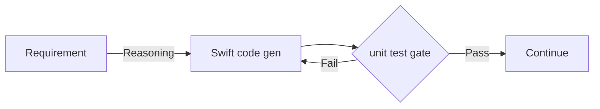
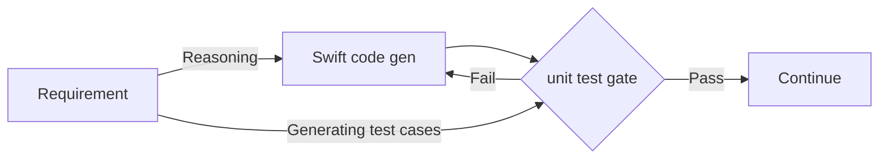

# AI Deterministic Engineering: Gates

## What is the gate?

In AI engineering, a gate  means a decision/checkpoint at the end of the loop to determines whether the loop is done. For example: after generating the Swift codes, we want to make sure it follows the [Airbnb Swift Style Guide](https://github.com/airbnb/swift). 

The gate can be implemented by the prompt engineering. For example, spawn a sub agent & use official [skill](https://swift.airbnb.tech/skill) to evaluate the new code gen. The skill by itself mostly declate the style guide so sub agent can use to compare & check.

> Why sub agent? The main loop agent evaluates its result cause the bias, the decision is mostly pass!

This approach sounds good but there are some drawbacks:
* Heavy rules, definitions, constraints, conditions, ... to make a right decision.
* Cost more tokens to evaluate if the definition is complicated
* The sub agent may not follow the instruction comprehensively to judge the context.
* Some models are good at making decision than others.

These drawbacks make prompt engineering solution become unpredictable & cause the loop be unreliable.

## Deterministic gate
Like the slogan: "Shut up & show me your code!". Code is always the best way to prove the ability & quality. We use pseudo code in interview to evaluate how candidates think. Here we also can use the code to make the decision instead of agent's reasoning. 

Back to our example, instead of using the [skill](https://swift.airbnb.tech/skill). We can use the [swiftlint](https://github.com/airbnb/swift/blob/master/Sources/AirbnbSwiftFormatTool/swiftlint.yml) to run with the configuration from Airbnb to evaluate.

By this way, there are many benefits:
* More deterninistic: we know exactly problem from line-by-line.
* Faster execution: running script is much faster than agent reasoning.
* Less token consumption: agent just runs the script rather than reasoning.

## The keys
Nothing is perfect, we can see many benefits by using deterministic vs prompt engineering gate but the prompt is dynamic at runtime, easier to implement, scale & distribute. Code/Script must be defined at build time, harder to maintain, scale & distribute. You can easily create a gate as a skill and everyone can use it, for the code/script snippet you have to make sure it works in all machine with difference binary versions, ...

Deterministic gate is mostly in-use by the custom loop, workflow or agent agentic system. We split the whole flow into smaller stages where the deterministic gate fit perfectly at the end of each stage to determine whether the flow continue to next stage or retry/rework to fulfill the gate check.

When the gate is unsastify, the retry/rework is necessary to bypass on the next check. This loop maybe expensive, set the max attempt & judge to exit properly.

> When retry/rework, make sure the gate result is injected to the context so the agent can know exactly why it fail & what's next to do.

## One more thing
Gate is perfect to place at the end of the loop to evaluate the output. For example, running the unit test successfully before moving to next stage

It works perfectly but, this loop only make sure the unit test passes for the generated codes, it means the agent mostly modifies the test cases not the original generated codes. In general, this gate won't improve the generated codes quality, it just make sure generated codes compiles/tests successfully.

To improve the code gen quality, we have to set the expectation from the begining! From the `Requirement` stage, we generate the test cases first:

It sounds like in [MVVM](https://github.com/kudoleh/iOS-Clean-Architecture-MVVM) architecture, we design the `ViewModel` first, the `View` is implemented later & must adapt the pre-defined `ViewModel`.

By this way, test cases are fixed & agent has to update the code gen to fulfill the given expected test cases. We can use high quality model such as `Opus` to find the correct expectation & use cheaper model like `Sonnet` to do the implementation.

This is exactly how [TDD (Test Driven Development)](https://en.wikipedia.org/wiki/Test-driven_development) works & we just use the deterministic gate to implement it!
